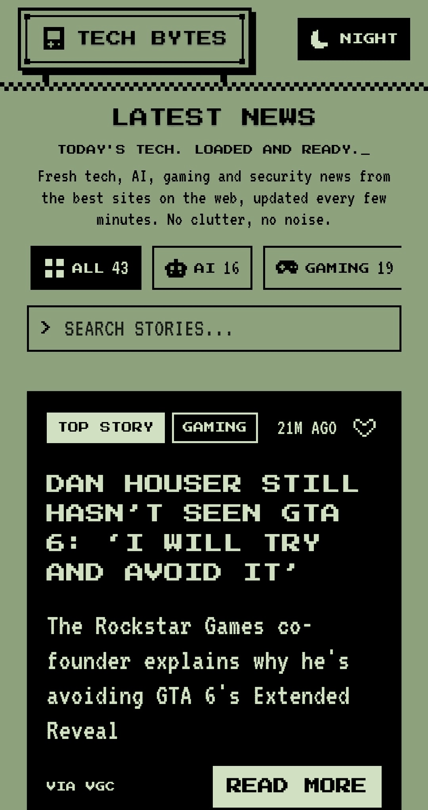
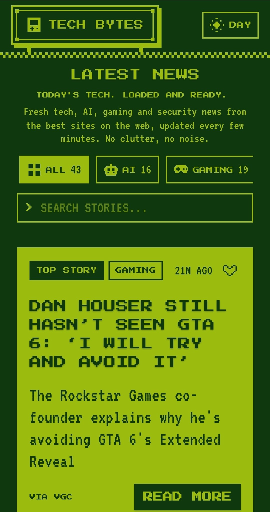
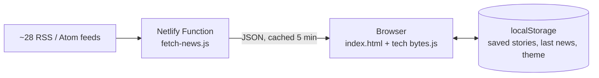

# Tech Bytes

**Tech, AI, gaming and security headlines from the best sites on the web, in one calm place, wrapped in a retro Game Boy interface.**

**[Open the live site](https://tech-byte-news.netlify.app/)**

Tech Bytes pulls fresh stories from about 28 publisher feeds, sorts them into four channels, removes spam and near-duplicates, and shows them in a pixel-art interface with day and night modes. Every card links back to the original article.

It is built with plain HTML, CSS and JavaScript. There is no framework and no build step, and the only server code is one small Netlify Function.

<table>
  <tr>
    <td align="center"><b>Day</b></td>
    <td align="center"><b>Night</b></td>
  </tr>
  <tr>
    <td></td>
    <td></td>
  </tr>
</table>

<table>
  <tr>
    <td align="center"><b>Phone, day</b></td>
    <td align="center"><b>Phone, night</b></td>
  </tr>
  <tr>
    <td></td>
    <td></td>
  </tr>
</table>

## Features

**Reading**
- **Fresh news.** About 28 RSS and Atom feeds, mixed and sorted newest first, with real times such as "16M AGO".
- **Four channels.** AI, Gaming, Gadgets and Security, each with a pixel icon and a live count. A story that fits none of them is dropped, so the feed stays on topic.
- **Search.** Type to filter instantly, across all channels or inside one.
- **Top story.** The newest story with a summary gets a large inverted card.
- **Load more.** 18 stories per page on computers and tablets, 12 on phones.

**Personal**
- **Saved stories.** Tap the heart on any card, then open the SAVED channel. Saves live in your browser and survive new news arriving.
- **Day and night mode.** Remembered between visits, applied before the page draws so there is no flash.

**Speed and resilience**
- **Instant repeat visits.** The last news is kept in the browser and shown immediately while fresh news loads in the background.
- **Placeholder cards** while loading, a "still loading" notice after 8 seconds, and a clear retry state if something fails.
- **Failure tolerant.** If a feed is down, it is skipped and the rest still load.

**Quality of life**
- Near-duplicate stories are merged, so five articles about the same headphones appear as one or two.
- A back-to-top button that rises above the footer instead of covering it.
- Keyboard focus styles, accessible labels, and reduced-motion support.

## How it works



1. **The function** (`netlify/functions/fetch-news.js`) requests every feed in parallel with a 3-second timeout per feed. It parses RSS and Atom without any dependency, keeps the newest 15 items per feed from the last 7 days, removes repeated links, and returns up to 100 stories sorted newest first.
2. **Netlify's CDN** keeps that answer for 5 minutes and serves a slightly old copy for up to 15 more minutes while it refreshes, so visitors rarely wait on the feeds.
3. **The page** (`tech bytes.js`) cleans titles and summaries, sorts each story into a channel, drops spam and off-topic items, merges near-duplicates, and renders the cards. It checks for new stories every 10 minutes and only redraws when something changed.

### Health check

Open `/.netlify/functions/fetch-news?debug=1` on the site. It lists every feed with whether it worked, how many stories it gave, its newest story, and how long it took.

## Tech stack

| Area | Choice |
| --- | --- |
| Front end | HTML, CSS and vanilla JavaScript (ES modules), no framework |
| Layout utilities | Tailwind CSS v3, pre-built into a static `tailwind.css` |
| Fonts | Press Start 2P and VT323 from Google Fonts |
| Back end | One Netlify Function on Node 18 or newer |
| Hosting | Netlify, deployed from this repository on every push |
| Data | Public RSS and Atom feeds, no API key |

## Project structure

```
Tech-Bytes/
├── index.html                  Page structure, share preview tags, theme script
├── tech bytes.css              Design system and all custom styles
├── tech bytes.js               Rendering, channels, search, saved stories, caching
├── tailwind.css                Pre-built Tailwind utilities
├── netlify/
│   └── functions/
│       └── fetch-news.js       Feed reader and health check
├── screenshots/                Images used in this README
├── site.webmanifest            Home-screen metadata
└── favicon and icon files
```

## Design system

The look is a monochrome handheld palette with sharp corners, 2px borders and stepped (not smooth) animation.

| Token | Day | Night |
| --- | --- | --- |
| Background | `#8CA17C` | `#0F380F` |
| Ink (text, borders) | `#000000` | `#9BBC0F` |
| On-ink (text on filled areas) | `#D0E0C0` | `#0F380F` |
| Panel | `#7A8C70` | `#306230` |

All colors are CSS variables, so night mode is a single attribute switch on the page.

## Decisions and trade-offs

- **RSS instead of a news API.** The first version used NewsAPI. Its free plan delays stories by about a day, limits requests, and is intended for development. Reading publishers' own feeds gives minute-fresh stories with no key and no quota.
- **No framework.** The interface is small and mostly static, so plain JavaScript keeps the page light, easy to read and free of build tooling.
- **Pre-built Tailwind.** The Tailwind CDN script is meant for prototyping, so the few utilities actually used are compiled into `tailwind.css`. Custom components use their own classes.
- **Keyword channels instead of machine learning.** Word lists are free, instant, predictable and easy to edit. The cost is occasional mis-sorting, and the lists are meant to be tuned.
- **Near-duplicate detection by headline words.** Cheap and effective for reposts of the same story. It can miss a duplicate worded very differently, and it is deliberately not stricter, because looser matching would merge stories that are genuinely different.
- **Saved copy plus CDN stale-while-revalidate.** Together they keep both first and repeat visits fast without a database.

## Limitations

- Feeds can move, change format or block servers. The function skips a failing feed, and the health check shows which one.
- Summaries come from each publisher's feed, so their length and quality vary.
- Saved stories are stored in the browser, so they do not sync between devices.
- The feed parser is intentionally lightweight, not a full XML parser.

## Attribution

Tech Bytes does not host or copy articles. It shows headlines and short summaries from publishers' public feeds and links every card back to the original article. All headlines and content belong to their publishers.

## Ideas for later

- A Game Boy-style screen frame around the news, with a power light that shows when the news last updated.
- Shareable filter and search links.
- Choosing which sources to follow.

## Author

**Kaleb Dawit**, front-end developer and designer.

[GitHub](https://github.com/kaleb2343) · [LinkedIn](https://www.linkedin.com/in/kaleb-dawit-678b26278/) · [X](https://x.com/Kaleb2343) · [Portfolio](https://kalebdawit.vercel.app)

## License

Copyright © 2026 Kaleb Dawit. All rights reserved. The source is public for viewing only. Please do not copy, redistribute or reuse the code, design or branding without written permission. See [LICENSE](LICENSE).
